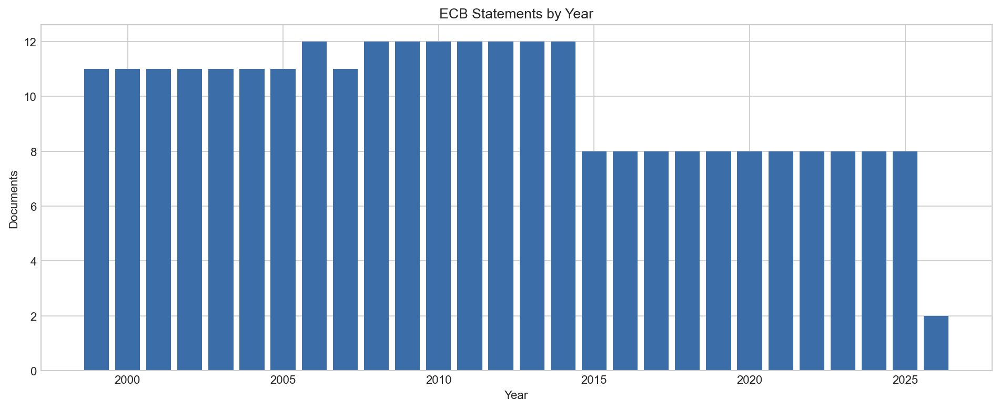
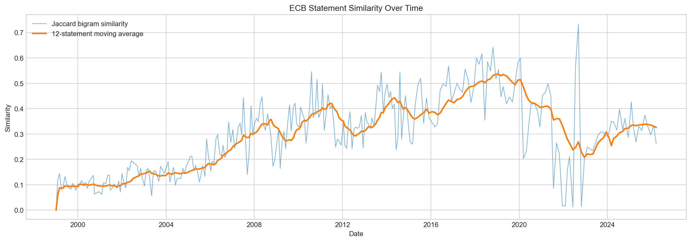
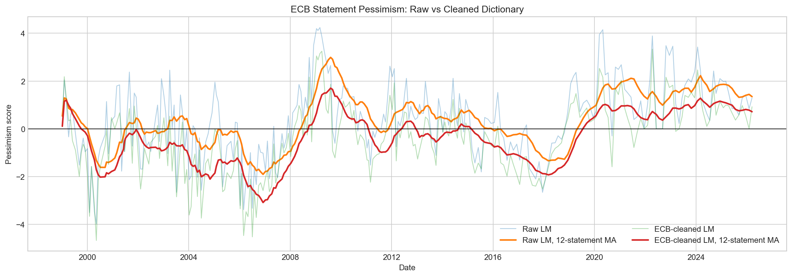
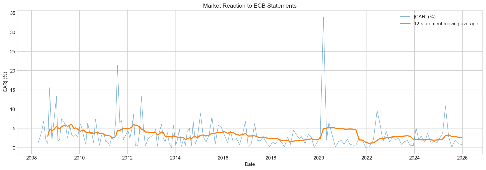
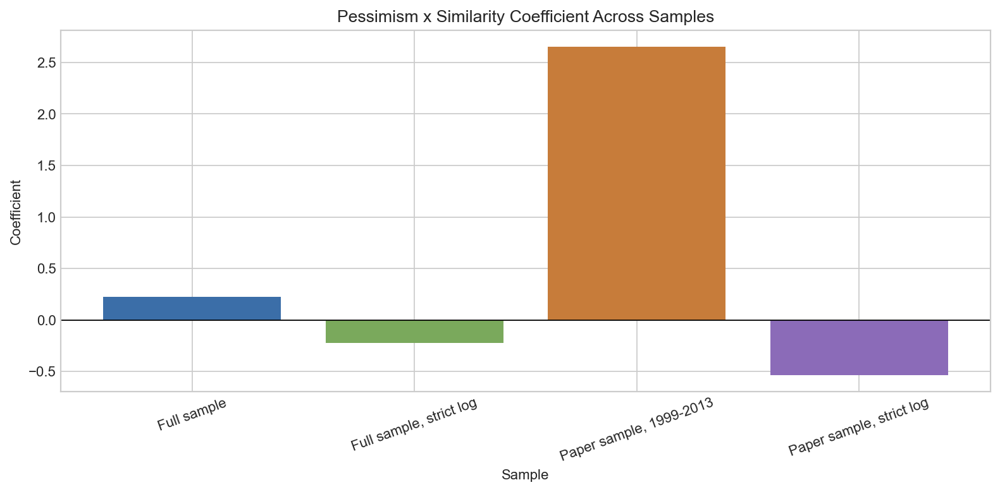

# NLP on ECB Speeches

This project studies European Central Bank monetary policy statements as text data and links communication patterns to financial market reactions. It replicates and extends the intuition of Amaya and Filbien (2015): central bank language can be measured, and changes in tone or repetition may help explain how markets react around policy events.

The full workflow is in [`nlp_ecb_v0.ipynb`](nlp_ecb_v0.ipynb). A clean rerun writes all reusable outputs to [`outputs/`](outputs/).

## Outputs

| Artifact | Path |
| --- | --- |
| Final analysis dataset | [`outputs/tables/analysis_dataset.csv`](outputs/tables/analysis_dataset.csv) |
| Documents by year | [`outputs/tables/documents_by_year.csv`](outputs/tables/documents_by_year.csv) |
| Similarity summary | [`outputs/tables/similarity_summary.csv`](outputs/tables/similarity_summary.csv) |
| Pessimism summary | [`outputs/tables/pessimism_summary.csv`](outputs/tables/pessimism_summary.csv) |
| Market reaction summary | [`outputs/tables/market_reaction_summary.csv`](outputs/tables/market_reaction_summary.csv) |
| Regression results | [`outputs/tables/regression_results.csv`](outputs/tables/regression_results.csv) |
| Link manifest | [`outputs/tables/link_manifest.csv`](outputs/tables/link_manifest.csv) |

## Methodology

| Stage | Method | Output |
| --- | --- | --- |
| Statement discovery | Use Chrome/Selenium to render and scroll the dynamic ECB monetary policy statement index | Candidate ECB statement links |
| Page extraction | Download each ECB HTML page with `requests` and parse it with BeautifulSoup | Date, title, link, statement text |
| Corpus filtering | Keep English statement pages with year-based URLs and remove known non-standard pages | Chronological statement dataset |
| Text cleaning | Lowercase, remove Q&A sections, strip punctuation/numbers, remove stopwords, stem words | `clean_text` |
| Similarity | Jaccard similarity on binary bigrams versus the previous statement | `similarity_sklearn` |
| Pessimism | Loughran-McDonald dictionary score, then ECB-specific kill-list cleaning | `pessimism_raw`, `pessimism_final` |
| Event study | Constant-mean model on Euro Stoxx 50 log returns, event window -5 to +5 | `CAR`, `ABS_CAR` |
| Regression | OLS with HC1 robust standard errors | Market-reaction model |

The executed sample contains 274 final ECB statements after filtering. The Chrome-rendered collector restores the early-history coverage that was missing from the temporary AddSearch-only run.



## Text Measures

Similarity is measured as the overlap in bigrams between each statement and the immediately previous statement:

```text
Jaccard similarity = shared bigrams / total unique bigrams
```

| statistic | value |
| --- | --- |
| count | 274.0 |
| mean | 0.293 |
| std | 0.1464 |
| min | 0.0 |
| 25% | 0.1645 |
| 50% | 0.3004 |
| 75% | 0.3995 |
| max | 0.7333 |



Pessimism is computed as:

```text
pessimism = ((negative words - positive words) / total words) * 100
```

| measure | mean | std | min | median | max |
| --- | --- | --- | --- | --- | --- |
| Raw LM | 0.3718 | 1.5468 | -3.972 | 0.4156 | 4.2391 |
| ECB-cleaned LM | -0.4183 | 1.4394 | -4.6729 | -0.3401 | 3.3333 |



## Market Reaction

The event-study outcome is the absolute cumulative abnormal return around each statement date. Expected returns are estimated with a constant-mean model over trading days -250 to -50, and abnormal returns are summed over days -5 to +5.

| statistic | CAR | ABS_CAR_percent |
| --- | --- | --- |
| count | 169.0 | 169.0 |
| mean | -0.0002 | 3.3702 |
| std | 0.0509 | 3.8067 |
| min | -0.3395 | 0.0066 |
| 25% | -0.0204 | 1.3055 |
| median | 0.0036 | 2.4578 |
| 75% | 0.0273 | 4.1723 |
| max | 0.1328 | 33.948 |



## Regression

The main regression tests whether markets react more strongly when statements are both pessimistic and similar to previous communication:

```text
ABS_CAR = beta0
        + beta1 * (pessimism_final * log(1 + similarity))
        + beta2 * DELTA_MRO
        + beta3 * INFLATION
        + beta4 * OUTPUT_GAP
        + error
```

| sample | interaction coefficient | p-value | nobs | R-squared |
| --- | ---: | ---: | ---: | ---: |
| Full sample | 0.2235 | 0.7332 | 168 | 0.1175 |
| Full sample, strict log | -0.2222 | 0.2453 | 168 | 0.1226 |
| Paper sample, 1999-2013 | 2.651 | 0.0617 | 69 | 0.0864 |
| Paper sample, strict log | -0.5339 | 0.1967 | 69 | 0.0768 |

Full coefficient tables are saved in [`outputs/tables/regression_results.csv`](outputs/tables/regression_results.csv).



## Main Findings

| Finding | Interpretation |
| --- | --- |
| ECB statements are textually persistent | The median statement shares about 30% of its unique bigrams with the previous statement. |
| Raw dictionary tone needs context | Central-bank terms such as `risk`, `liquidity`, `objective`, and `easing` can distort generic financial sentiment scores. |
| Market reactions are skewed | Median absolute CAR is modest, but the maximum event reaction is much larger. |
| Full-sample communication effect is weak | The main interaction is positive but not statistically significant in the full rerun sample. |
| Earlier sample is more suggestive | The 1999-2013 interaction is positive and marginally significant, closer to the paper-style hypothesis. |

## Conclusion

The project shows that ECB communication can be transformed into transparent, reproducible text measures. Similarity captures continuity in policy language, while the cleaned Loughran-McDonald pessimism score gives a more ECB-aware tone measure than the raw dictionary.

The market-reaction evidence is mixed. In the full rerun sample, the pessimism-similarity interaction is not statistically significant. In the 1999-2013 sample, the interaction is positive and marginally significant, suggesting that the relationship between central bank wording and market reaction may be regime-dependent.

Overall, ECB language contains measurable information, but dictionary tone and textual repetition alone do not fully explain market reactions across the modern policy period.

## Extensions

| Extension | Why it matters |
| --- | --- |
| Save and reuse a fixed link manifest | The dynamic ECB page can change over time; a manifest locks the exact corpus for replication. |
| Use intraday returns | Daily event windows can include unrelated news; intraday data would isolate ECB communication more cleanly. |
| Add monetary policy surprise controls | Market reactions should depend on unexpected policy news, not only statement wording. |
| Compare dictionary sentiment with transformer sentiment | FinBERT or a central-bank-specific model may classify tone more accurately. |
| Add topic models | Similarity may reflect boilerplate or persistent economic topics; topic models can separate these channels. |
| Model regimes separately | Crisis, low-rate, pandemic, and inflation-surge periods likely have different communication effects. |

## Reproducibility

The notebook now creates the output folder automatically:

```text
outputs/
  figures/
  tables/
```

To regenerate the notebook and outputs:

```bash
/opt/anaconda3/bin/python -m nbconvert --execute --to notebook --inplace nlp_ecb_v0.ipynb --ExecutePreprocessor.timeout=1200
```

External data sources include the ECB website rendered through Chrome/Selenium, Yahoo Finance through `yfinance`, FRED through `pandas_datareader`, and the local Loughran-McDonald dictionary CSV.
