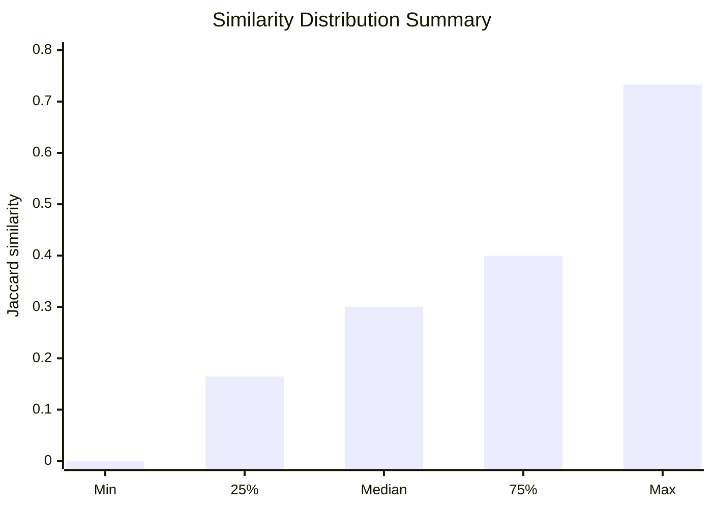
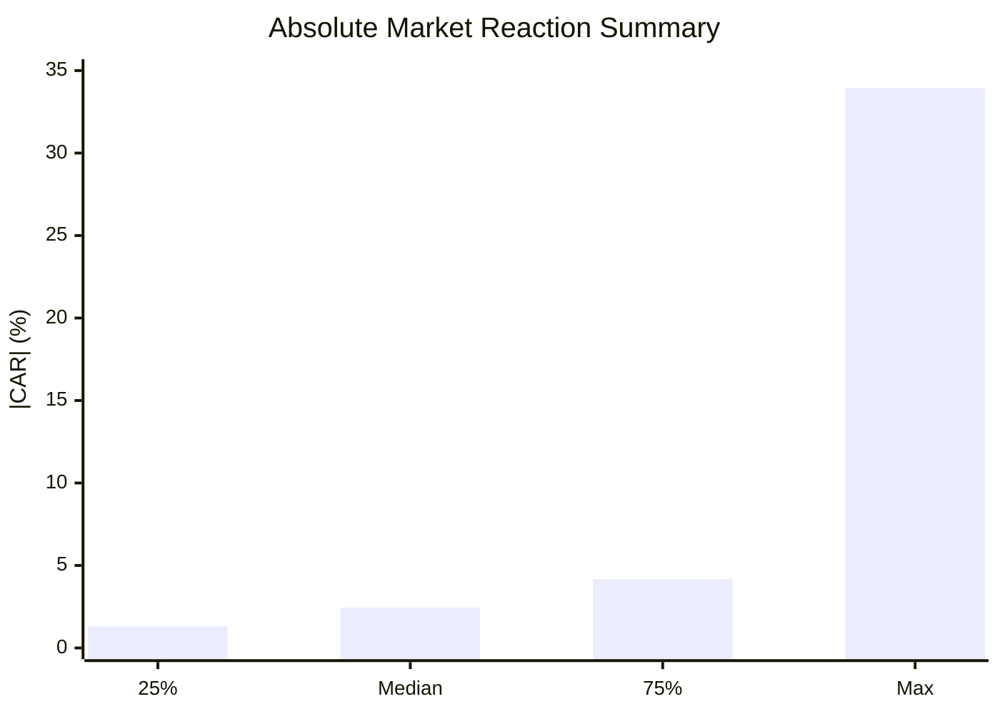
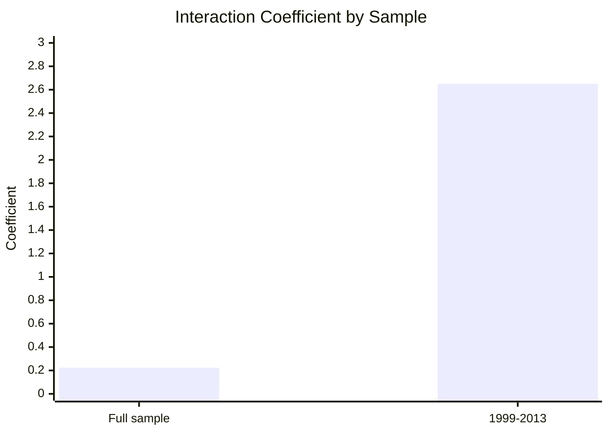

# NLP on ECB Speeches

This project studies how European Central Bank monetary policy statements changed over time, and whether those communication patterns are related to financial market reactions. It replicates and extends the text-as-data logic of Amaya and Filbien (2015) by scraping ECB press conference statements, measuring textual similarity and pessimism, and linking those measures to Euro Stoxx 50 event-window returns.

The full workflow is implemented in [`nlp_ecb_v0.ipynb`](nlp_ecb_v0.ipynb).

## Project Overview

| Component | Description |
| --- | --- |
| Corpus | ECB monetary policy statement / introductory statement pages |
| Main sample | 1999-2026 scraped statements, with 1998 and known non-standard pages removed |
| Text measures | Jaccard similarity on binary bigrams and Loughran-McDonald pessimism |
| Market measure | Euro Stoxx 50 cumulative abnormal return around statement dates |
| Controls | Policy rate change, inflation, and output gap |
| Main question | Do more pessimistic and textually similar ECB statements produce stronger market reactions? |

## Methodology

### 1. Data Collection

ECB statement links are collected from the ECB monetary policy statement index using Selenium. Each statement page is then downloaded with `requests`, parsed with BeautifulSoup, and converted into a structured dataset containing the statement link, title, date, year, and extracted text content.

| Step | Method | Output |
| --- | --- | --- |
| Link discovery | Selenium scroll + anchor extraction | Candidate ECB statement URLs |
| Page parsing | BeautifulSoup over ECB HTML pages | Raw statement text, title, date |
| Filtering | Remove 1998 and manually identified intruder links | Chronological statement corpus |
| Validation | Date sorting and URL assertions | Clean analysis dataframe |

### 2. Text Preprocessing

Text is lowercased, Q&A sections are removed where detected, punctuation and numbers are stripped, stopwords are removed, and tokens are stemmed with the Porter stemmer. The tokenizer intentionally uses simple whitespace splitting after regex normalization, so the notebook does not depend on NLTK `punkt` downloads.

| Cleaning Choice | Reason |
| --- | --- |
| Remove Q&A markers | Focuses on the prepared monetary policy statement rather than journalist exchange |
| Keep alphabetic text, apostrophes, hyphens | Preserves economically relevant terms while removing formatting noise |
| Remove stopwords | Reduces common English terms that do not carry policy tone |
| Stem tokens | Aligns statement vocabulary with stemmed dictionary entries |

### 3. Similarity Measure

Statement similarity is computed against the immediately previous statement. The project uses binary bigram vectors and Jaccard similarity:

```text
similarity(i, i-1) = shared bigrams / total unique bigrams across both statements
```

This captures how much each statement repeats the wording of the prior policy communication.

| Similarity Statistic | Value |
| --- | ---: |
| Mean | 0.2930 |
| Standard deviation | 0.1464 |
| Minimum | 0.0000 |
| Median | 0.3004 |
| Maximum | 0.7333 |



### 4. Pessimism Measure

Pessimism is measured with the Loughran-McDonald financial sentiment dictionary:

```text
pessimism = ((negative words - positive words) / total words) * 100
```

The project first computes a raw dictionary score, then cleans the dictionary for ECB-specific false positives and false negatives. For example, terms such as `risk`, `liquidity`, `objective`, `easing`, and `press` can be technically neutral in ECB communication even though they may appear sentiment-bearing in a general financial dictionary.

| Pessimism Measure | Mean | Std. Dev. | Min | Median | Max |
| --- | ---: | ---: | ---: | ---: | ---: |
| Raw LM | 0.3718 | 1.5468 | -3.9720 | 0.4156 | 4.2391 |
| ECB-cleaned LM | -0.4183 | 1.4394 | -4.6729 | -0.3401 | 3.3333 |

```mermaid
xychart-beta
    title "Raw vs ECB-Cleaned Pessimism"
    x-axis ["Mean", "Median", "Min", "Max"]
    y-axis "Pessimism score" -5 --> 5
    bar [0.3718, 0.4156, -3.9720, 4.2391]
    bar [-0.4183, -0.3401, -4.6729, 3.3333]
```



### 5. Event Study

Market reactions are measured with Euro Stoxx 50 log returns. For each ECB statement date, the project computes cumulative abnormal returns using a constant-mean expected return model.

| Event-Study Setting | Value |
| --- | --- |
| Asset | Euro Stoxx 50 (`^STOXX50E`) |
| Expected return model | Constant mean return |
| Estimation window | -250 to -50 trading days |
| Event window | -5 to +5 trading days |
| Outcome variable | `ABS_CAR = abs(CAR) * 100` |

| Market-Reaction Statistic | CAR | \|CAR\| (%) |
| --- | ---: | ---: |
| Observations | 169 | 169 |
| Mean | -0.0002 | 3.3702 |
| Standard deviation | 0.0509 | 3.8067 |
| Median | 0.0036 | 2.4578 |
| Maximum | 0.1328 | 33.9480 |



### 6. Regression Design

The final regression tests whether the interaction between pessimism and similarity explains the absolute market reaction, controlling for policy and macroeconomic conditions:

```text
ABS_CAR = beta0
        + beta1 * (pessimism_final * log(1 + similarity))
        + beta2 * DELTA_MRO
        + beta3 * INFLATION
        + beta4 * OUTPUT_GAP
        + error
```

Heteroskedasticity-robust standard errors are used.

| Full-Sample Regression Result | Coefficient | p-value |
| --- | ---: | ---: |
| Interaction: pessimism x similarity | 0.2235 | 0.733 |
| Policy rate change (`DELTA_MRO`) | -3.1335 | 0.142 |
| Inflation | 0.3314 | 0.111 |
| Output gap | -0.6622 | 0.218 |
| Observations | 168 |  |
| R-squared | 0.117 |  |

| Paper-Sample Check: 1999-2013 | Coefficient | p-value |
| --- | ---: | ---: |
| Interaction: pessimism x similarity | 2.6510 | 0.062 |
| Policy rate change (`DELTA_MRO`) | -1.0816 | 0.817 |
| Inflation | 0.6496 | 0.331 |
| Output gap | -0.2940 | 0.575 |
| Observations | 69 |  |
| R-squared | 0.086 |  |



## Main Findings

| Finding | Interpretation |
| --- | --- |
| ECB statements show meaningful wording persistence | The median statement shares about 30% of its unique bigrams with the previous statement. |
| Raw sentiment needs central-bank-specific cleaning | Generic financial dictionaries can misclassify neutral ECB terms such as liquidity, objective, risk, and easing. |
| Market reaction is skewed | The median absolute CAR is moderate, but the maximum event reaction is much larger, indicating occasional high-impact meetings. |
| Full-sample text interaction is not statistically significant | In the extended sample, the pessimism-similarity interaction does not robustly explain absolute market reactions. |
| Earlier sample gives a stronger signal | In the 1999-2013 check, the interaction coefficient is positive and marginally significant, closer to the paper-style interpretation. |

## Conclusion

The project shows that ECB communication can be quantified in a transparent and reproducible way using relatively simple NLP tools. Similarity captures the degree of continuity in ECB language, while the cleaned Loughran-McDonald pessimism score gives a central-bank-adjusted measure of communication tone.

The strongest evidence appears in the earlier paper-style sample, where the interaction between pessimism and similarity is positive and close to conventional significance. In the broader extension sample, however, the same relationship weakens. This suggests that the communication-market reaction link may be period-dependent, potentially reflecting changes in ECB communication strategy, forward guidance, market expectations, unconventional policy, and post-2014 monetary policy regimes.

Overall, the analysis supports the idea that central bank communication contains measurable information, but it also shows that dictionary-based tone and repetition alone are not enough to fully explain market reactions across the modern ECB era.

## Extensions

| Extension | Why It Matters |
| --- | --- |
| Use intraday financial data | Daily windows may mix ECB effects with unrelated market news; intraday returns would isolate announcement effects better. |
| Add topic modeling | Similarity can be high because of repeated boilerplate or because the same economic topic persists; topics would separate these channels. |
| Use sentence-level sentiment | Some statements combine optimistic and pessimistic sections; sentence aggregation could capture nuance. |
| Compare dictionary sentiment with transformer models | FinBERT or central-bank-specific language models may classify ECB tone better than word lists. |
| Model regime changes | Pre-crisis, sovereign debt crisis, low-rate, pandemic, and inflation-surge periods may have different communication effects. |
| Add surprise controls | Market reactions should depend on the unexpected part of policy and language, not only the observed statement text. |
| Export intermediate datasets | Saving cleaned statements, text scores, CARs, and macro controls would make the project easier to audit and reuse. |

## Reproducibility Notes

The notebook uses online sources, so some results can change as providers update data:

| Dependency | Role |
| --- | --- |
| ECB website | Statement links and text |
| Yahoo Finance / `yfinance` | Euro Stoxx 50 prices |
| FRED / `pandas_datareader` | Policy rate, inflation, GDP macro controls |
| Loughran-McDonald dictionary | Financial sentiment word lists |
| `scikit-learn` | Bigram vectorization |
| `statsmodels` | OLS regression and robust standard errors |

For a more stable replication package, the next step should be to save versioned CSV outputs after each major stage of the pipeline.
