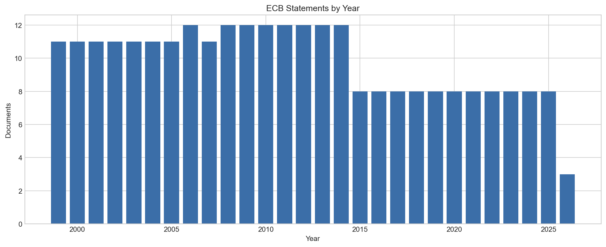
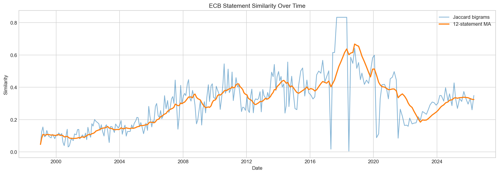
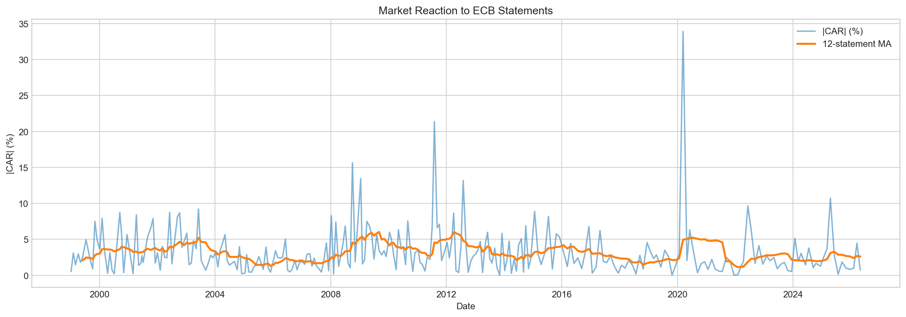

# NLP on ECB Speeches

This project reproduces and extends Amaya and Filbien (2015), [The Similarity of
ECB's Communication](https://www.sciencedirect.com/science/article/pii/S1544612314000877).
It measures the similarity and tone of ECB monetary policy statements, then
tests how their interaction is associated with Euro Stoxx 50 reactions.

The audited workflow is [`reproduce_results.py`](reproduce_results.py). It
collects the current ECB archive, validates the original 1999-2013 corpus, runs
the paper-period reproduction, and extends the sample through 30 April 2026.
[`nlp_ecb_v0.ipynb`](nlp_ecb_v0.ipynb) is retained as a legacy exploratory
notebook.

## Paper Reproduction

The original paper studies 172 introductory statements from January 1999 to
December 2013. The audited public-data reproduction recovers all 172 documents
and the exact MRO announcement distribution.

| Metric | Paper | Reproduction |
| --- | ---: | ---: |
| Statements | 172 | 172 |
| Mean similarity | 0.2400 | 0.2416 |
| Minimum similarity | 0.0500 | 0.0309 |
| Maximum similarity | 0.5500 | 0.5452 |
| Mean absolute CAR (%) | 3.2800 | 3.4378 |
| Mean inflation (%) | 2.0300 | 2.0598 |
| Non-zero MRO announcements | 33 | 33 |
| Similarity trend coefficient, with controls | 0.4930 | 0.4636 |
| Pessimism x log(similarity), with controls | -0.2430 | -0.2212 |

The main market-reaction result is close to the paper and has the same sign:

| Paper-period model | Paper coefficient | Reproduction coefficient | p-value | n |
| --- | ---: | ---: | ---: | ---: |
| Pessimism only | 0.5300 | 0.4999 | 0.0012 | 172 |
| Pessimism x log(similarity) only | -0.2660 | -0.2437 | 0.0044 | 172 |
| Pessimism x log(similarity), with controls | -0.2430 | -0.2212 | 0.0081 | 172 |

Full benchmark details are saved in
[`outputs/tables/paper_comparison.csv`](outputs/tables/paper_comparison.csv).

## Extension Results

The refreshed dataset contains 275 statements from 7 January 1999 through
30 April 2026. The post-paper extension contains 103 statements from 2014
onward.

| Sample | Tone measure | Interaction coefficient | p-value | n |
| --- | --- | ---: | ---: | ---: |
| 2014 onward | Raw Loughran-McDonald | -0.6050 | 0.2150 | 103 |
| 2014 onward | ECB-cleaned sensitivity | -0.5002 | 0.2510 | 103 |
| Full 1999 onward | Raw Loughran-McDonald | -0.1846 | 0.0279 | 275 |
| Full 1999 onward | ECB-cleaned sensitivity | -0.1731 | 0.0398 | 275 |

The extension is directionally consistent with the paper, but the separate
2014-onward interaction is not statistically significant. The full-sample
association remains negative and is statistically significant at the 5%
level for both tone specifications. Because the separately estimated
post-paper coefficient is not significant, the extension does not establish
persistence; it is consistent with a relationship that varies across policy
regimes.

Across the full sample, mean similarity is `0.2966`, median similarity is
`0.2962`, mean absolute CAR is `3.2010%`, and median absolute CAR is `2.3577%`.








## Outputs

| Artifact | Path |
| --- | --- |
| Final analysis dataset | [`outputs/tables/analysis_dataset.csv`](outputs/tables/analysis_dataset.csv) |
| Fixed link manifest | [`outputs/tables/link_manifest.csv`](outputs/tables/link_manifest.csv) |
| Paper comparison | [`outputs/tables/paper_comparison.csv`](outputs/tables/paper_comparison.csv) |
| Market regressions | [`outputs/tables/regression_results.csv`](outputs/tables/regression_results.csv) |
| Similarity regressions | [`outputs/tables/similarity_regression_results.csv`](outputs/tables/similarity_regression_results.csv) |
| Documents by year | [`outputs/tables/documents_by_year.csv`](outputs/tables/documents_by_year.csv) |
| Similarity summary | [`outputs/tables/similarity_summary.csv`](outputs/tables/similarity_summary.csv) |
| Pessimism summary | [`outputs/tables/pessimism_summary.csv`](outputs/tables/pessimism_summary.csv) |
| Market reaction summary | [`outputs/tables/market_reaction_summary.csv`](outputs/tables/market_reaction_summary.csv) |

## Reproduce

Install dependencies and run the audited pipeline:

```bash
/opt/anaconda3/bin/python -m pip install -r requirements.txt
/opt/anaconda3/bin/python reproduce_results.py \
  --lm-dictionary /path/to/Loughran-McDonald_MasterDictionary_1993-2025.csv
```

If `--lm-dictionary` is omitted, the runner checks `LM_DICTIONARY`, then the
default download location
`~/Downloads/Loughran-McDonald_MasterDictionary_1993-2025.csv`.
